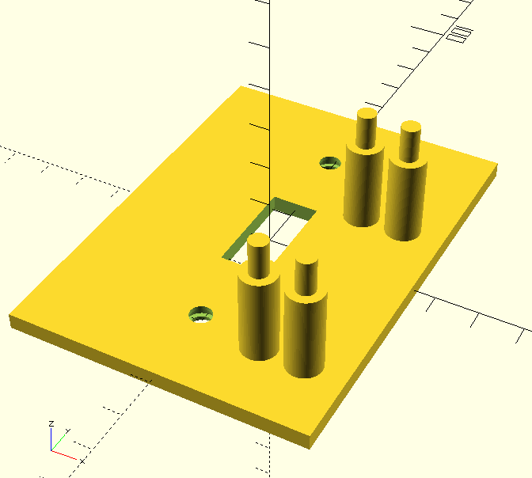
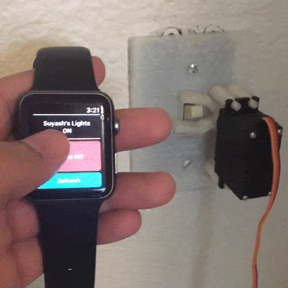

# smart-lights
This project is a hassle-free cloud connected lighting system that interfaces with standard light switches via a 3D printed lightswitch cover with a built-in servo mount (see `3DModels/` for STL and OpenSCAD code). 

This project uses an ESP8266 WiFi microcontroller along with my [conduit](https://github.com/suyashkumar/conduit) IoT service/library to expose functionality that can be called via a RESTful API from anywhere in the world!

The whole stack for this project--including firmware, hardware, server (see my [conduit](https://github.com/suyashkumar/conduit) repo), client web appliction, and physical 3D printed components were designed and built from the ground up. 

 

## Structure

- `3DModels/`: OpenSCAD code for lightswitch cover
- `firmware/`: Firmware for the ESP8266 microcontroller
- `web/`: ReactJS web interface to interact with [conduit](https://github.com/suyashkumar/conduit) to call functions & get data from the ESP8266 chip
